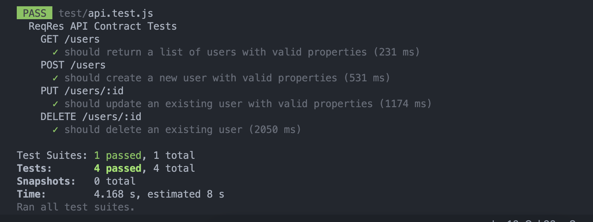

The script above is a set of tests written using the Jest and supertest libraries to test the ReqRes API. The tests include:

- A test for the GET /users endpoint that checks if the response contains a list of users with valid properties.
- A test for the POST /users endpoint that checks if a new user can be created with valid properties.
- A test for the PUT /users/:id endpoint that checks if an existing user can be updated with valid properties.
- A test for the DELETE /users/:id endpoint that checks if an existing user can be deleted.

Each test uses the supertest library to send HTTP requests to the ReqRes API and checks the response using Jest's assertions. The beforeAll() hook is used to set up a user object to use in test cases. Also, console.log statements are used to display the response data for each test.

# RUN
- npm test

